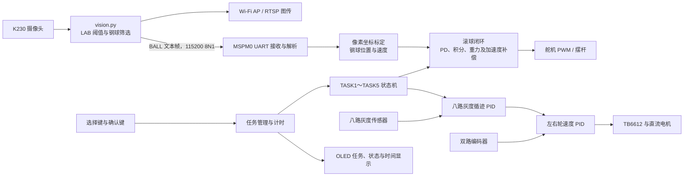

# 2026 年全国大学生电子设计竞赛 H 题：车载平衡滚球运动控制系统

[](./LICENSE)

本仓库保存我们为 2026 年全国大学生电子设计竞赛赛区赛（TI 杯）H 题“车载平衡滚球运动控制系统”编写的控制与视觉代码。

系统由循线小车、带凹槽摆杆、钢球位置视觉检测装置和摆杆角度控制机构组成。小车沿黑色环形路线行驶时，MSPM0G3507 同时完成车辆循迹、轮速闭环、任务管理和摆杆控制；庐山派 K230 负责检测钢球位置，并通过 UART 将测量结果发送给主控。

> [!IMPORTANT]
> 本仓库中的阈值、PID 参数、像素坐标、舵机角度和里程参数均来自特定实车。机械结构、摄像头位置、电机、轮径或传感器发生变化后，必须重新标定和调参，不建议直接烧录后上车运行。

## 赛题资料与约束

完整题目见：[H题_车载平衡滚球运动控制系统.pdf](./code/H题_车载平衡滚球运动控制系统.pdf)。

与本项目直接相关的主要约束如下：

- 环形路线黑线宽度为 `1.8 ± 0.2 cm`，AB、CD 直线段长 `1.5 m`，BC、DA 为半径 `0.5 m` 的半圆弧。
- 小车长、宽不超过 `35 cm × 25 cm`，采用轮式驱动和车载电池供电。
- 摆杆距离小车平台的高度 `h ≥ 5 cm`；摆杆由长 `25 cm` 的 4 分 PPR 水管改造，槽内钢球直径约 `1 cm`。
- 小车行驶过程中不得人为干预或遥控，投影完全脱离轨迹线则该次测试失败。
- 钢球位置必须由摄像头检测，图传画面需要覆盖完整摆杆并能清楚显示运动轨迹。

## 已实现任务

OLED 上的 `TASK1`～`TASK5` 对应赛题要求第 2～6 项：

| 程序任务 | 赛题要求 | 当前实现 |
| --- | --- | --- |
| `TASK1` | 小车从 A 点出发，顺时针行驶一圈并停回 A 点；总时间不超过 20 s，停车偏差不超过 2 cm | 八路灰度循迹、轮速 PID、横向标志线检测、丢线搜索与超时停车 |
| `TASK2` | 小车静止，钢球从 `+5 cm` 运动至 `-5 cm` 并稳定；用时不超过 5 s，最大误差不超过 1 cm | 分阶段滚球闭环，先到 `+5 cm`，再折返并保持在 `-5 cm` 附近 |
| `TASK3` | 小车由 A 点行驶并通过 B 点，钢球保持在中心附近；AB 用时不超过 8 s，误差不超过 1 cm | 视觉滚球闭环与循迹并行，使用编码器平均里程判断 B 点，并在通过后平滑减速 |
| `TASK4` | 小车行驶一圈并通过 A 点，钢球保持在中心附近；总时间不超过 30 s，误差不超过 1 cm | 循迹、启停线识别、加减速前馈和滚球闭环；当前实车目标带有 `-0.3 cm` 补偿 |
| `TASK5` | 钢球从摆杆任意指定位置开始，小车行驶一圈并保持该位置；总时间不超过 30 s，误差不超过 1 cm | 启动后静止采样 3 s，以平均位置作为目标，行驶中叠加弯管补偿并在 A 点停车 |

上述时间和误差是赛题评分条件，不代表仓库代码已经在其他硬件上达到相同指标。

## 系统架构



车辆控制与滚球控制分别由 `10 ms` 周期定时器驱动。主循环处理按键事件和 OLED 刷新，中断负责采样、闭环运算和任务状态推进。

## 硬件组成

- 天猛星 MSPM0G3507 开发板
- 庐山派 K230 / K230D 视觉开发板与摄像头
- TB6612 双路直流电机驱动
- 两个带正交编码器的直流减速电机
- 八路数字灰度循迹传感器
- MPU6050 惯性传感器
- I²C OLED 显示屏
- 舵机及摆杆滚球机构
- 约 `1 cm` 直径钢球
- 两个任务选择/确认按键

### MSPM0G3507 引脚分配

以下内容来自 [`empty.syscfg`](./code/ccs_workspace/Problem_H/empty.syscfg)。仅列出程序使用的信号，电源、地线和下载接口仍需按开发板原理图连接。

| 模块 | 信号 | MSPM0G3507 引脚 | 说明 |
| --- | --- | --- | --- |
| TB6612 | `AIN1` / `AIN2` | `PA8` / `PA9` | 电机 A 方向 |
| TB6612 | `BIN1` / `BIN2` | `PB18` / `PA7` | 电机 B 方向 |
| TB6612 | `STBY` | `PB24` | 驱动使能 |
| TB6612 | `PWMA` / `PWMB` | `PA12` / `PA13` | TIMG0 PWM 输出 |
| 编码器 A | `AA` / `AB` | `PA21` / `PA22` | A 相计数、B 相方向判断 |
| 编码器 B | `BA` / `BB` | `PB19` / `PB20` | A 相计数、B 相方向判断 |
| 灰度传感器 | `L4`、`L3`、`L2`、`L1` | `PA26`、`PA24`、`PA15`、`PA17` | 左侧四路数字输入 |
| 灰度传感器 | `R1`、`R2`、`R3`、`R4` | `PA16`、`PA14`、`PA25`、`PA28` | 右侧四路数字输入 |
| 按键 | `SELECT` / `CONFIRM` | `PB13` / `PB14` | 低电平有效，内部上拉 |
| OLED | `SDA` / `SCL` | `PB3` / `PB2` | I2C1 |
| MPU6050 | `SDA` / `SCL` | `PA0` / `PA1` | I2C0 |
| 舵机 | PWM | `PA27` | TIMG7，50 Hz |
| K230 通信 | `UART0_TX` / `UART0_RX` | `PA10` / `PA11` | `115200 8N1` |
| 状态 LED | `LED_0` | `PB22` | 通用 GPIO |

> [!CAUTION]
> 电机和舵机可能产生较大的瞬态电流。请根据器件额定电压设计独立、可靠的供电，并确保 K230、MSPM0G3507 和电机驱动共地。不要仅依据软件仓库推断电源接法。

### K230 与 MSPM0 UART 接线

| K230 | MSPM0G3507 | 用途 |
| --- | --- | --- |
| GPIO11 / `UART2_TXD` | `PA11` / `UART0_RX` | K230 向主控发送钢球位置 |
| GPIO12 / `UART2_RXD` | `PA10` / `UART0_TX` | 预留反向通信；当前主流程未使用 |
| GND | GND | 通信共地 |

两端均配置为 `115200 baud`、8 数据位、无校验、1 停止位（`8N1`）。连接前请确认两块开发板 UART 电平兼容。

## 软件环境

| 部分 | 当前工程记录的环境 |
| --- | --- |
| MSPM0 工程 | Code Composer Studio（Theia 工程） |
| MSPM0 SDK | `2.11.00.07` |
| SysConfig | `1.26.2` |
| TI Arm Clang | `4.0.4.LTS` |
| K230 主视觉 | 支持 `media.*`、`machine.UART/FPIOA`、`network` 和 `libs.WBCRtsp` 的 CanMV 固件 |
| K230 YOLO 示例 | 文件注释记录为庐山派 Lite / K230D、CanMV `v1.8` |

主视觉程序没有在仓库中锁定精确的 CanMV 固件版本。如果运行时找不到 `libs.WBCRtsp` 或 API 不兼容，请使用庐山派对应固件和配套库，不要直接替换为名称相近但接口不同的函数。

## 目录结构

```text
.
├── LICENSE                            # 项目原创软件代码的 MIT License
├── THIRD_PARTY_NOTICES.md             # 第三方材料及许可边界
└── code/
    ├── H题_车载平衡滚球运动控制系统.pdf
    ├── ccs_workspace/
    │   └── Problem_H/
    │       ├── main.c                  # MSPM0 程序入口
    │       ├── empty.syscfg            # 外设、时钟和引脚配置
    │       └── user_driver/
    │           ├── competition_tasks.c # TASK1～TASK5 状态机
    │           ├── task_manager.c      # 按键选择、计时和 OLED 状态
    │           ├── pid.c               # 八路灰度循迹 PID
    │           ├── motor.c             # 编码器、里程与轮速闭环
    │           ├── duoji.c             # 舵机和滚球闭环
    │           ├── uart.c              # K230 数据帧解析
    │           └── ...                 # OLED、按键、MPU6050 等驱动
    └── K230_vision/
        ├── vision.py                   # 阈值视觉、UART 和 RTSP 主程序
        ├── command.txt                 # 默认 RTSP 地址记录
        ├── steel_boll/                 # YOLO 钢球检测备选演示及模型
        ├── usrt_send/                  # UART 测试（目录名沿用仓库现状）
        └── examples/                   # CanMV 示例，不属于比赛主流程
```

`code/ccs_workspace/Problem_H/Debug` 中包含构建产生的文件，不是源码入口。实际阅读和修改应优先从 `main.c`、`empty.syscfg` 和 `user_driver` 开始。

## UART 数据协议

K230 每帧发送一行 ASCII 文本，以换行符结束：

```text
BALL,valid,x,error_neg11,error_neg5,error_zero,error_pos5,error_pos11\n
```

示例：

```text
BALL,1,413,303,133,0,-142,-337
BALL,0,-1,0,0,0,0,0
```

| 字段 | 含义 |
| --- | --- |
| `valid` | `1` 表示检测到有效钢球，`0` 表示当前帧无有效目标 |
| `x` | 钢球中心在 K230 图像中的 X 坐标；无目标时为 `-1` |
| `error_neg11` | `x - DETECT_X_MIN`，相对 `-11 cm` 参考点的像素误差 |
| `error_neg5` | `x - PIPE_NEG_5CM_X`，相对 `-5 cm` 刻度的像素误差 |
| `error_zero` | `x - PIPE_ZERO_CM_X`，相对中心点的像素误差 |
| `error_pos5` | `x - PIPE_POS_5CM_X`，相对 `+5 cm` 刻度的像素误差 |
| `error_pos11` | `x - DETECT_X_MAX`，相对 `+11 cm` 参考点的像素误差 |

MSPM0 在 UART 接收中断中组帧并严格检查字段数量、整数范围和 `valid` 值。有效帧随后由滚球模块根据五个标定点分段换算为 `-11 cm`～`+11 cm` 的位置。

## 使用方法

### 1. 获取仓库

```bash
git clone https://github.com/XiaoboShang/NUEDC_2026.git
cd NUEDC_2026
```

### 2. 准备并连接硬件

1. 按照上方引脚表连接电机驱动、编码器、灰度传感器、OLED、MPU6050、舵机和按键。
2. 交叉连接 K230 与 MSPM0 的 UART，并连接公共地。
3. 架起车轮或断开电机动力电源，先检查方向信号、编码器符号和舵机极限，避免首次运行时机构冲撞。
4. 确认摆杆水平角和允许活动范围后，再进行带球测试。

### 3. 运行 K230 视觉程序

1. 使用与庐山派固件匹配的 CanMV IDE 打开 [`K230_vision/vision.py`](./code/K230_vision/vision.py)。
2. 确认固件中存在 `libs.WBCRtsp`，摄像头编号和 LCD 配置与实际板卡一致。
3. 先完成检测区域和刻度像素标定，再运行程序。
4. 观察屏幕上的检测框和串口输出，确认钢球从左到右运动时，X 坐标连续且方向正确。
5. 如需开机自启动，可在验证无误后按当前 CanMV 固件的启动规则将程序部署为 `/sdcard/main.py`。

程序会创建默认热点：

```text
SSID: K230-BALL
Password: 12345678
```

连接热点后，应以程序打印的实际 IP 组装 RTSP 地址：

```text
rtsp://<K230-IP>:8554/test
```

[`K230_vision/command.txt`](./code/K230_vision/command.txt) 中记录的默认地址为 `rtsp://192.168.169.1:8554/test`，但不同固件或网络配置下 IP 可能变化。公开展示或长期使用前，请修改仓库中的默认热点密码。

### 4. 导入 MSPM0 工程

1. 安装与工程记录相匹配的 MSPM0 SDK、SysConfig 和 TI Clang 工具链。
2. 在 Code Composer Studio 中导入 [`ccs_workspace/Problem_H`](./code/ccs_workspace/Problem_H) 现有工程。
3. 打开 `empty.syscfg`，确认器件为 MSPM0G3507、封装为 LQFP-64，并检查自动生成的引脚是否与实车一致。
4. 在上车前检查电机方向、编码器计数、灰度逻辑、舵机水平角和 K230 数据帧。
5. 按自己的调试流程完成编译、下载和硬件验证。

### 5. 选择任务

上电初始化完成后，OLED 默认显示 `TASK1`：

- 按 `SELECT`（PB13）在 `TASK1`～`TASK5` 间循环选择。
- 按 `CONFIRM`（PB14）初始化并启动当前任务。
- 运行时 OLED 显示经过时间；任务失败时显示 `FAIL`。
- 任务完成后计时冻结，但部分任务会继续保持钢球闭环或执行停车过程。

当前状态机不提供从结束状态返回选择界面的按键逻辑。重复测试前请按实际调试流程复位主控并重新确认机械安全。

## 标定与调参

### K230 视觉标定

主要参数位于 [`K230_vision/vision.py`](./code/K230_vision/vision.py) 顶部：

| 参数 | 用途 |
| --- | --- |
| `BALL_THRESHOLD` | 钢球区域的 LAB 阈值 |
| `DETECT_X_MIN` / `DETECT_X_MAX` | 检测区域左右边界，同时作为 `-11 cm` / `+11 cm` 参考点 |
| `DETECT_Y_MIN` / `DETECT_Y_MAX` | 摆杆槽所在的纵向 ROI |
| `PIPE_NEG_5CM_X` | `-5 cm` 刻度的 X 坐标 |
| `PIPE_ZERO_CM_X` | 中心 `0 cm` 的 X 坐标 |
| `PIPE_POS_5CM_X` | `+5 cm` 刻度的 X 坐标 |
| `BALL_PIXELS_MIN` / `BALL_PIXELS_MAX` | 候选区域像素数量范围 |
| 形状与填充率参数 | 排除反光、边缘和非钢球区域 |

推荐标定顺序：

1. 固定摄像头、摆杆和光源，禁止标定后再移动相对位置。
2. 关闭或弱化自动曝光造成的画面漂移，采集不同球位和环境光下的图像。
3. 调整 ROI，使完整摆杆处于检测范围内，同时排除车体和背景。
4. 依次将钢球放在 `-11 cm`、`-5 cm`、`0 cm`、`+5 cm`、`+11 cm`，记录中心 X 坐标。
5. 调整 LAB、像素数量和形状阈值，确认无球帧稳定输出 `valid=0`，有球帧稳定输出 `valid=1`。
6. 检查 RTSP 画面、UART 帧与实际刻度方向一致后，再开启舵机闭环。

### MSPM0 控制参数

| 参数类别 | 主要位置 | 注意事项 |
| --- | --- | --- |
| 各任务目标、里程、速度和超时 | `user_driver/competition_tasks.c` | 参数按任务隔离，修改前先确认对应 `TASK` |
| 各任务循迹 PID 与速度斜坡 | `competition_tasks.c` 中的 `line_pid_config_t` | 速度单位为 `mm/s`，加减速度单位为 `mm/s²` |
| 灰度加权、丢线和终点逻辑 | `user_driver/pid.c` | 先确认八路灰度左右顺序和黑白逻辑 |
| 编码器线数与轮径 | `user_driver/motor.h` | 当前代码记录为 `390` 和 `65 mm`，更换电机或轮胎必须修改 |
| 舵机水平角和安全范围 | `user_driver/duoji.h` | 当前水平角为 `145°`，软件限制范围为 `110°`～`180°` |
| 滚球 PD、积分、重力与前馈 | `competition_tasks.c` 中各任务的 `duoji_ball_control_config_t` | 每个任务独立配置，避免用单组参数覆盖全部工况 |
| UART 超时和位置范围 | `user_driver/duoji.h` | 当前视觉超时为 `200 ms`，位置范围为 `-11 cm`～`+11 cm` |

建议先分别调通视觉、舵机、轮速和循迹，再组合任务状态机。滚球闭环应从较小倾角和较低增益开始，持续监控视觉丢帧、舵机饱和、钢球冲出摆杆以及车辆加减速引起的惯性扰动。

## 已知注意事项

- 主视觉采用 LAB 阈值与连通域筛选，强反光、阴影、背景颜色和摄像头自动曝光都可能影响识别。
- `ENABLE_FALLBACK_BALL` 默认开启，会在严格形状筛选失败时使用面积最大的候选区域；调试时应结合画面确认没有锁定错误目标。
- 任务参数是实车调试快照，并非通用参数集；更换机械结构后需要重新验证控制方向、角度极限和稳定性。
- `code/K230_vision/steel_boll` 是 YOLO 备选演示，当前比赛主控制链路使用 `vision.py` 的阈值视觉和文本 UART 协议。
- 仓库包含 CanMV 示例、模型文件和 CCS 构建产物，阅读代码时应注意区分项目源码、厂商示例与生成文件。
- 本仓库没有附带完整机械图纸、供电设计和实测数据，不能仅凭软件仓库复刻整车。

## 作者与许可

项目维护者：[XiaoboShang](https://github.com/XiaoboShang)。

本项目中由 `Albert.Shang` 有权许可的原创软件代码采用 [MIT License](./LICENSE)：

```text
Copyright (c) 2026 Albert.Shang
```

MIT License 允许使用、复制、修改、合并、发布、分发、再许可及销售软件副本，但必须在软件副本或主要部分中保留版权声明和许可证声明；软件按“原样”提供，不附带担保。

仓库中的竞赛题目、TI 模板与生成文件、CanMV/K230 示例、第三方 UART 示例、模型文件及固件运行库不因存放在本仓库中而自动改用 MIT License。具体范围和再分发注意事项见 [THIRD_PARTY_NOTICES.md](./THIRD_PARTY_NOTICES.md)。

## 致谢

- 全国大学生电子设计竞赛组委会与赛题专家组
- Texas Instruments MSPM0 平台及其 DriverLib、SysConfig 工具链
- 庐山派 K230 / CanMV 软硬件生态
